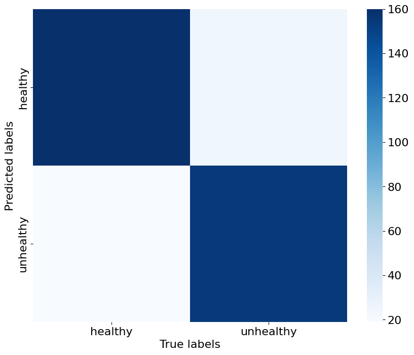

# Plant Health Classification with CNNs and Transfer Learning

## 1) Introduction  

**Project Objective**  
This project addresses a **binary image classification** problem: given an RGB image of a plant, the task is to predict whether it is **healthy** or **unhealthy**.  
The solution is based on **Convolutional Neural Networks (CNNs)** and **transfer learning** on several pre-trained architectures.  

The main goals are:
- building a clean and balanced dataset,
- comparing custom CNNs and modern pre-trained models,
- evaluating performance both on a local test set and on hidden **remote test sets** provided via CodaLab.

---

## 2) Dataset Description  

**Source and Structure**  
The dataset consists of **5,200 labeled RGB images** of plant leaves:

- image size: **96×96** pixels  
- channels: RGB  
- classes:  
  - **healthy**  
  - **unhealthy**  

Initially, the dataset is **imbalanced**: the healthy class outnumbers the unhealthy class by a factor of about **1.8×**.  

The data is split into three subsets:

- **training set**  
- **validation set** (≈ 10% of the original dataset)  
- **local test set** (≈ 10% of the original dataset)  

using stratified sampling and a fixed random seed to ensure reproducibility.  

### 🌱 Dataset Examples  

---

## 3) Data Cleaning and Preprocessing  

### 3.1 Visual Inspection and Outlier Removal  

The dataset is first inspected **visually** to understand the type of images and detect outliers.  
Despite the expectation of clearly spotted or discoloured leaves, most plants appear visually similar across classes, with only a few evident outliers (non-plant images, wrong content). These outliers are removed from the dataset.  

### 3.2 Duplicate Detection  

To improve generalization and reduce redundancy, **duplicate images** are identified and removed.  
Duplicates are detected by **comparing the RGB matrices** of the images.  

### 3.3 Class Imbalance Handling  

Because the healthy class is about 1.8 times more frequent, class imbalance is initially addressed with **data augmentation** on the minority (unhealthy) class. Augmentations include:

- horizontal / vertical **flips**  
- small **rotations**  
- **translations**  

Later in the project, a different strategy is also considered: **downsampling** the majority (healthy) class to match the size of the unhealthy class, which proves very effective for ConvNeXt-based models.

### 🔄 Data Augmentation Examples  

<!-- TODO: insert an image showing original vs augmented samples -->
<!-- Example:

-->

---

## 4) Baseline CNN: QuasiVGG9  

As a first approach, a custom CNN inspired by VGG architectures, named **QuasiVGG9**, is trained as a baseline model.

**Architecture (QuasiVGG9)**

- 4 convolutional blocks:
  - the first 3 blocks end with **MaxPooling2D**
  - the last block ends with **GlobalAveragePooling2D**
- regularization techniques:
  - **weight decay**
  - **early stopping**
  - **ReduceLROnPlateau**

**Performance (QuasiVGG9)**

- local test accuracy: ~ **0.78**  
- remote test accuracy: ~ **0.60**  

This model provides a reasonable baseline but shows limitations in generalization, especially on the remote test sets.  

---

## 5) Transfer Learning with Keras Applications  

To improve performance, **pre-trained CNNs** from `keras.applications` are used with transfer learning and fine-tuning.  

### 5.1 Xception and EfficientNetV2S  

The first transfer learning experiments are based on:

- **Xception**
- **EfficientNetV2S**

Both are used as base models with:

- `GlobalAveragePooling2D` head  
- `Dropout` layer (dropout values between 0.2 and 0.5)  
- final dense layer for binary classification  

All layers of the base model are eventually set to **trainable** to perform **fine-tuning**.  

**Results**

- both models reach accuracy around **0.84** on the **local test set**  
- **EfficientNetV2S** shows better overall metrics and a better confusion matrix than Xception  
- on the **remote test set**, EfficientNetV2S reaches accuracy ≈ **0.82**, Xception ≈ **0.77**  

However, both models suffer from **overfitting**, even with early stopping and regularization.  

### 5.2 EfficientNetB1  

Building on the success of EfficientNetV2S, **EfficientNetB1** is also tested, using similar heads and fine-tuning strategies.  

- local test accuracy ≈ **0.84**  
- remote test accuracy ≈ **0.82**  

This makes EfficientNetB1 the best EfficientNet-based model in this project.

---

## 6) Exploring Other Pre-trained Models  

Additional architectures from Keras are evaluated:

- **VGG16** (~138M parameters)  
- **MobileNetV2** (~4.3M parameters)  

Neither VGG16 nor MobileNetV2 provides improvements over EfficientNetV2S and EfficientNetB1 in terms of accuracy on the local or remote test sets.  

These results motivate the switch to a different family of models: **ConvNeXt**.

---

## 7) Transfer Learning with ConvNeXt  

Two ConvNeXt variants are tested:

- **ConvNeXtSmall**  
- **ConvNeXtLarge**  

using different combinations of:

- data preprocessing and balancing strategies  
- augmentation layers (flip, rotation, Gaussian noise)  
- classifier heads on top of the pre-trained backbone  
- fine-tuning schemes (unfreezing layers, adjusting learning rate)  

### 7.1 ConvNeXtSmall  

- local test accuracy ≈ **0.73**  
- considered insufficient compared to EfficientNet-based models  

### 7.2 ConvNeXtLarge and Dataset Rebalancing  

ConvNeXtLarge (≈ 200M parameters) initially reaches local test accuracy ≈ **0.81**.  
To further improve performance, the **dataset balancing strategy** is revisited:

- instead of heavy augmentation, the healthy class is **downsampled** to match the number of unhealthy samples  
- the training data is split into two portions:
  - one for initial training with the base model frozen
  - a smaller subset for fine-tuning with the base model unfrozen  

With this pipeline, ConvNeXtLarge achieves:

- **0.88** accuracy on the **local test set**  
- **0.86** accuracy on the **remote test set**  

These results make ConvNeXtLarge the **best-performing model** overall.  
Attempts to freeze/unfreeze different blocks or further reduce the learning rate do not improve over this best configuration.

### 📉 Training Curves (ConvNeXtLarge)  

<!-- TODO: insert an image with train/validation accuracy/loss curves for ConvNeXtLarge -->
<!-- Example:

-->

### 🔎 Confusion Matrix (ConvNeXtLarge)  

<!-- TODO: insert an image with the 2×2 confusion matrix for ConvNeXtLarge -->
<!-- Example:

-->

---

## 8) Model Comparison  

Overall performance across the main models can be summarized as follows:

- **QuasiVGG9**: reasonable baseline, limited generalization  
- **EfficientNetV2S / EfficientNetB1**: strong gains over the baseline, good performance on remote test sets, some overfitting  
- **ConvNeXtLarge**: best overall performance with balanced data and fine-tuning  

### 📊 Model Comparison  

<!-- TODO: insert an image with a bar chart comparing accuracy (and/or F1) across models -->
<!-- Example:

-->

---

## 9) Conclusions

**Key Insights**

- Proper **data cleaning** (outlier and duplicate removal) is crucial for robust performance.  
- Handling **class imbalance** significantly impacts model quality; in this project, **downsampling** the majority class proves more effective than heavy augmentation alone.  
- Modern **pre-trained architectures** (EfficientNet, ConvNeXt) provide strong baselines, but require careful tuning to avoid overfitting.  
- ConvNeXtLarge, combined with a well-balanced dataset and moderate augmentation, offers the best trade-off between performance and robustness.  

## 📫 Contacts
- ✉️ Email: simone.logatto@outlook.com
- 🔗 LinkedIn: [Simone Lo Gatto](https://www.linkedin.com/in/simonelogatto/)
- 🐙 GitHub: @SimoneLoGatto00

